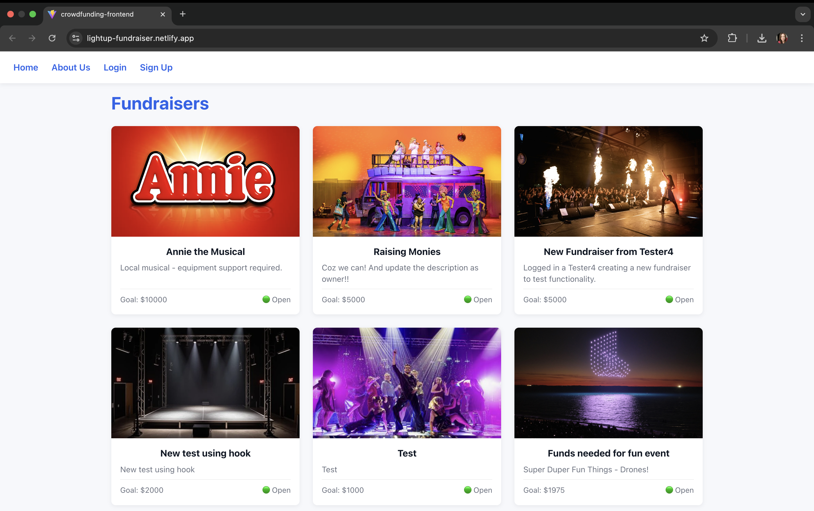
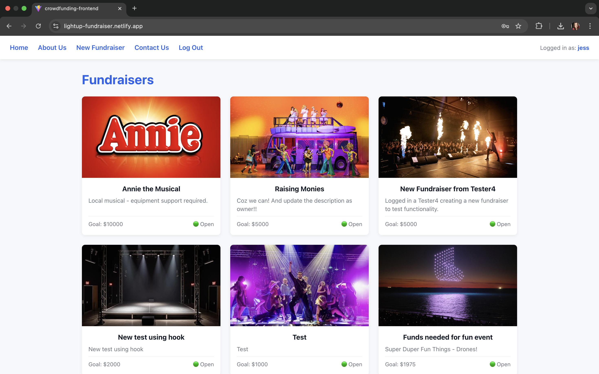
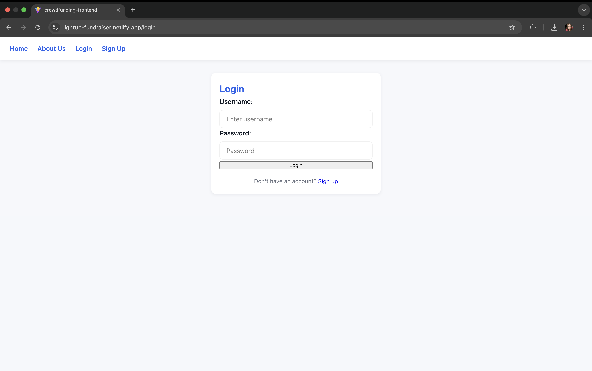
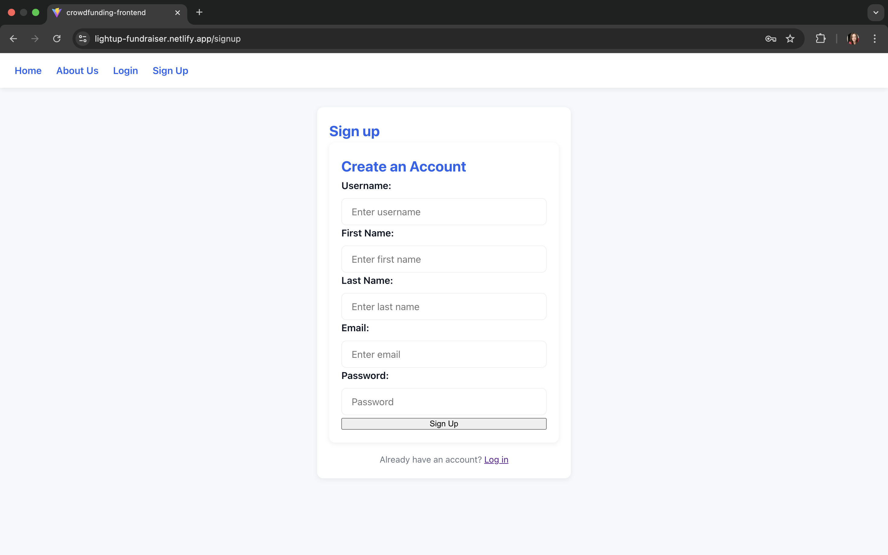
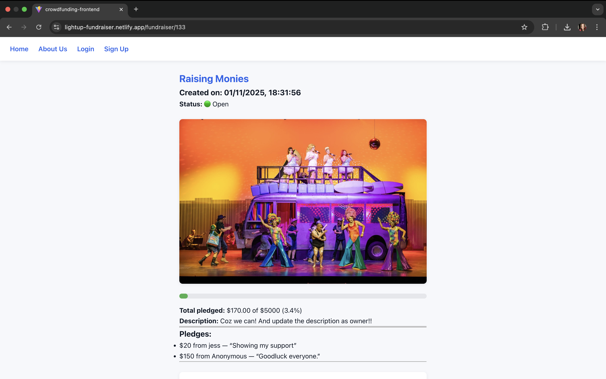
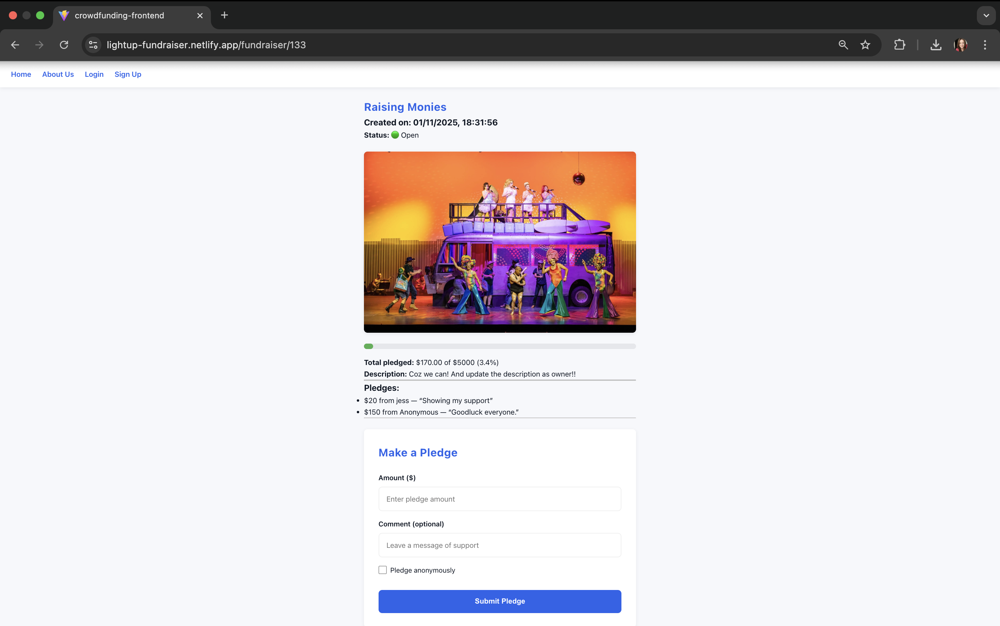
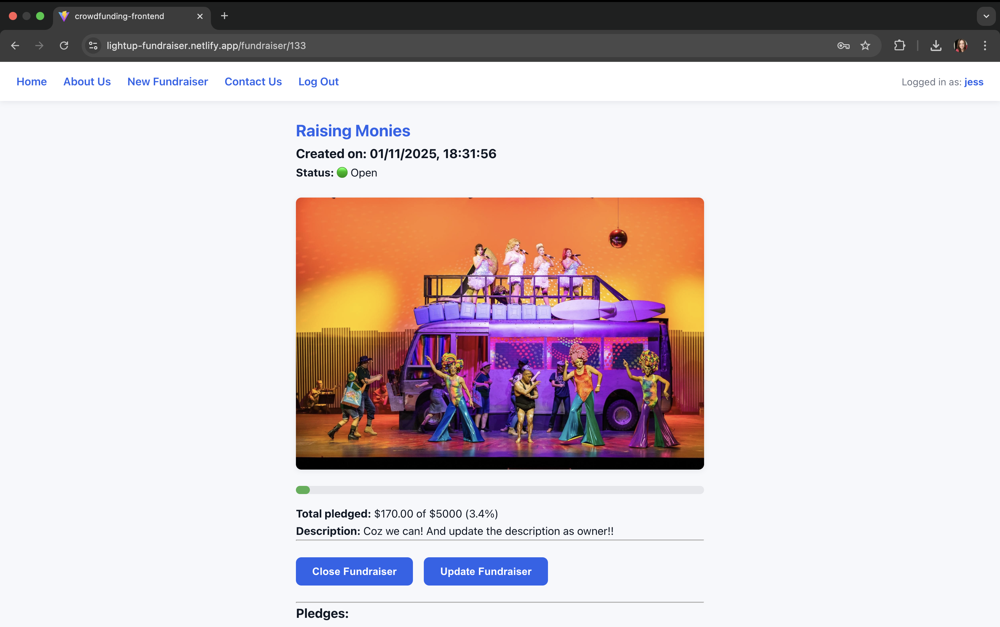

# React + Vite

This template provides a minimal setup to get React working in Vite with HMR and some ESLint rules.

Currently, two official plugins are available:

- [@vitejs/plugin-react](https://github.com/vitejs/vite-plugin-react/blob/main/packages/plugin-react) uses [Babel](https://babeljs.io/) (or [oxc](https://oxc.rs) when used in [rolldown-vite](https://vite.dev/guide/rolldown)) for Fast Refresh
- [@vitejs/plugin-react-swc](https://github.com/vitejs/vite-plugin-react/blob/main/packages/plugin-react-swc) uses [SWC](https://swc.rs/) for Fast Refresh

## React Compiler

The React Compiler is not enabled on this template because of its impact on dev & build performances. To add it, see [this documentation](https://react.dev/learn/react-compiler/installation).

## Expanding the ESLint configuration

If you are developing a production application, we recommend using TypeScript with type-aware lint rules enabled. Check out the [TS template](https://github.com/vitejs/vite/tree/main/packages/create-vite/template-react-ts) for information on how to integrate TypeScript and [`typescript-eslint`](https://typescript-eslint.io) in your project.

# LightUp Front End
Jessica Keating

## Overview
**LightUp** is a crowdfunding web application that allows community groups, schools, theatres, and event organisers to raise funds for lighting, sound, and stage production needs.  
This repository contains the **React frontend**, which connects to the Django REST Framework **backend API**.  

The frontend is built with **React + Vite**, featuring dynamic routing, responsive design, and integration with the backend endpoints to manage users, fundraisers, and pledges.

---

## Planning
### Concept/Name
**LightUp** – a play on the theme of “lighting up” community creativity and connection.  
The app helps bring local productions and events to life by connecting organisers with supporters who can fund their lighting and sound needs.

### Intended Audience
- Community theatre groups needing lighting or sound hire  
- School production teams seeking help for AV equipment  
- Local event organisers raising funds for staging or effects  
- Supporters wanting to directly contribute to creative, local events  

### Core User Stories
1. As a **visitor**, I can view open fundraisers to discover local projects.  
2. As a **supporter**, I can log in and pledge to a fundraiser.  
3. As a **supporter**, I can choose to pledge anonymously.  
4. As a **fundraiser owner**, I can create, edit, or close my fundraisers.  
5. As a **user**, I can sign up and log in securely.  

---

## Technical Details
### Tech Stack
- **Frontend Framework:** React (Vite)  
- **Routing:** React Router DOM  
- **State Management:** React Context + Hooks  
- **HTTP Client:** Fetch API  
- **Backend API:** Django REST Framework (Heroku Deployment)  
- **Deployment:** Netlify  

---

## Front End Pages & Functionality
- **Home Page**
  - Displays all open fundraisers.
  - Highlights featured campaigns.
  - Links to login/signup or individual fundraiser pages.

- **Fundraiser Detail Page**
  - Shows full fundraiser description, goal, and progress bar.
  - Displays list of pledges (including anonymous ones).
  - Pledge form for logged-in users.

- **Create Fundraiser Page**
  - Form for logged-in users to create new fundraisers.
  - Input validation and error handling.

- **Sign Up / Log In Page**
  - Combined authentication interface for new and returning users.
  - Token-based login handled via Django API.
  - Automatically updates NavBar on successful login.

- **NavBar**
  - Dynamically displays links based on authentication state.
  - Hides “Sign Up” link if user is logged in.

---

## Integration with Backend
### Deployment

Frontend Deployment:
https://lightup-frontend.netlify.app

Backend API (Heroku):
https://lightup-38603a824c6f.herokuapp.com

---

## Frontend Screenshots

Homepage while not logged in as a user.
 

Homepage when logged in. SHow username in the navbar on the right. 

Login page.

Signup page.

Fundraiser page while not logged in as a user.

Fundraiser page while not logged in as a user, zoomed out to show the pledges form.

Fundraiser page while logged in as a user, the user that is the owner of the fundraiser. The buttons for Close and Update Fundriaser will only show if the logged in user is the owner of that fundraiser. Therefore, there is no error that I can show for an attempt to update if not the owner. 

